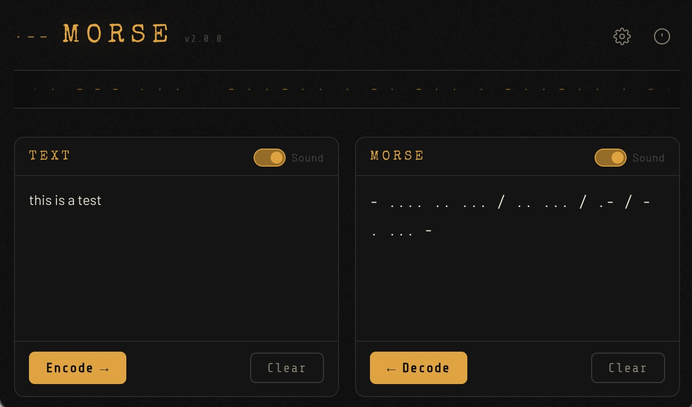

## Morse Code Converter/Player PWA

Progressive Web App that converts text ↔ Morse code with optional audio playback.

## Files

| File | Description |
|------|-------------|
| `app.js` | JavaScript app code |
| `index.html` | Application entry point/GUI |
| `manifest.json` | Application manifest |
| `README.md` | Release notes and instructions |
| `styles.css` | UI stylesheet |
| `sw.js` | Audio tone playback via `javax.sound` |
| `MorseConverterTest.java` | JUnit 5 unit tests |
| `pom.xml` | Maven build file |

### Supported Characters

- Letters: A–Z (case-insensitive)
- Digits: 0–9
- Punctuation: `. , ? ! - / @ ( )`

### Run
To operate properly this app needs to be run from an HTTP server running SSL